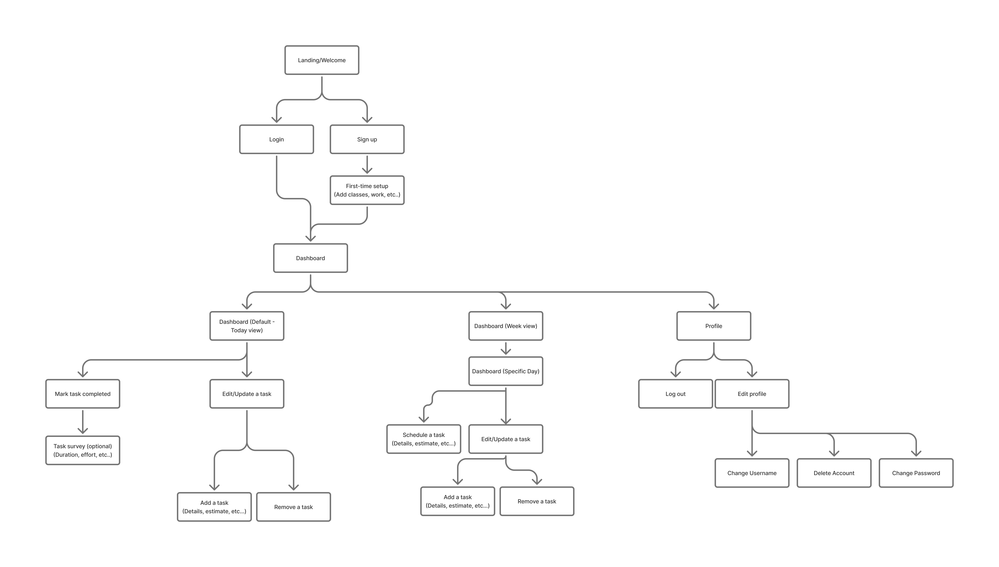
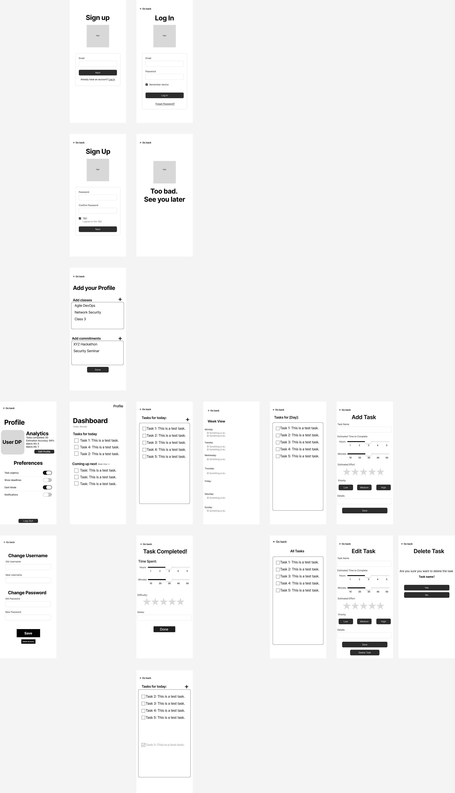

# User Experience Design

## Prototype

[PocketPlan prototype](https://www.figma.com/design/QSwUNiKtrR6uuHXAWUNdaP/PocketPlan-Wireframe?node-id=1-131&t=yMsXUNkaD3qIcn6l-1)

---

## App Map

The app map shows the main user flows. Entry is through **Landing/Welcome**, then **Login** or **Sign up**. New users go through **First-time setup** (e.g. add classes, work) before reaching the **Dashboard**. The Dashboard is the hub for **Today view**, **Week view**, and **Profile**. From Today view users can mark tasks completed (with an optional task survey), or edit/update tasks (add or remove). From Week view users open a **Specific Day**, then schedule tasks or edit/update tasks. From **Profile** users can log out or **Edit profile** (change username, delete account, change password).

---

## Wireframe Diagrams

The wireframes define the mobile-first layout for each screen type. The diagram below shows the full set of screens in one overview.

### Authentication & Onboarding

| Screen | Purpose |
|--------|--------|
| **Sign up** | New users enter email, password, confirm password; link to log in. |
| **Log In** | Returning users enter email and password; includes "Forgot Password?" |
| **Add your Profile** | New users add their classes/commitments. |
| **"Too bad. See you later"** | Shown when the user forgot their password. |

### Profile & Settings

| Screen | Purpose |
|--------|--------|
| **Profile** | Main profile: avatar, Analytics toggle, Preferences (e.g. Dark Mode, Notifications), Change Username, Change Password. |
| **Change Username** | New username field with Save and Cancel. |
| **Change Password** | Current password, new password, confirm new password; Save and Cancel. |

### Task Management

| Screen | Purpose |
|--------|--------|
| **Dashboard (Tasks for Today)** | Today’s tasks and completed tasks with checkboxes; "+" to add a task; "See more" when list is long. |
| **Week View** | Week-level view of tasks/dates. |
| **Add Task** | Create task: name, priority, due date, difficulty rating, description; Add and Cancel. |
| **Task Completed!** | Optional task completion survery. |
| **Edit Task** | Same fields as Add Task, pre-filled; Save and Cancel. |
| **Delete Task** | Confirmation: "Are you sure?" with Yes and No. |

*Functionality notes:*
- Today view is the default dashboard; Week view leads to a specific day for scheduling.
- Marking a task completed can lead to an optional task survey (duration, effort, etc.).
- Edit/Update a task covers both editing existing tasks and the flows for add/remove from the app map.